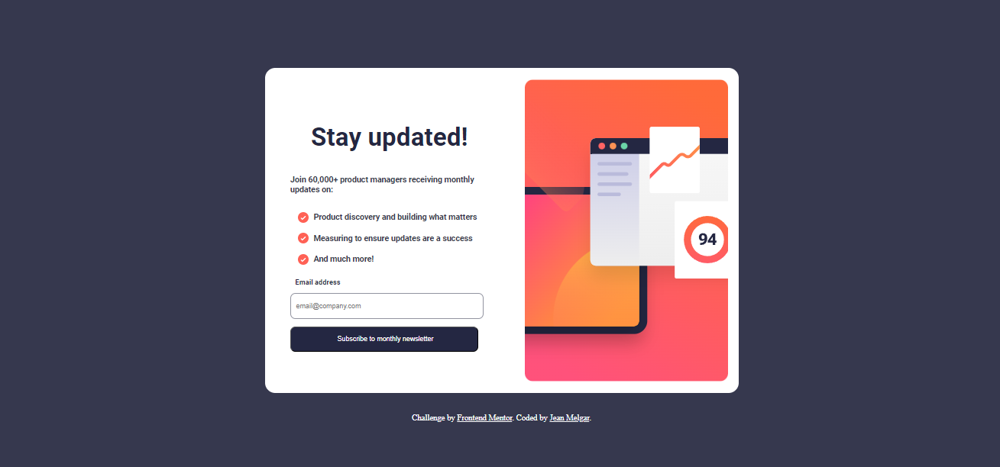
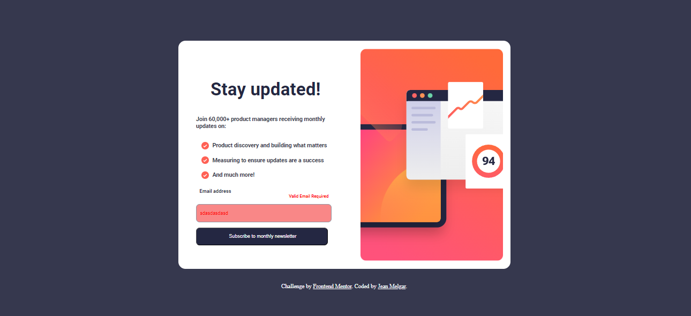
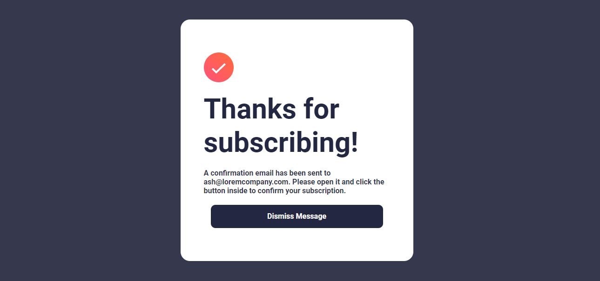

# Frontend Mentor - Newsletter sign-up form with success message solution

This is a solution to the [Newsletter sign-up form with success message challenge on Frontend Mentor](https://www.frontendmentor.io/challenges/newsletter-signup-form-with-success-message-3FC1AZbNrv). Frontend Mentor challenges help you improve your coding skills by building realistic projects. 

## Table of contents

- [Overview](#overview)
  - [The challenge](#the-challenge)
  - [Screenshot](#screenshot)
  - [Links](#links)
- [My process](#my-process)
  - [Built with](#built-with)
  - [What I learned](#what-i-learned)
  - [Continued development](#continued-development)
  - [Useful resources](#useful-resources)
- [Author](#author)
- [Acknowledgments](#acknowledgments)


## Overview
 este es un proyecto sacado de FrontEnd Mentor , el cual realize en mi tiempo libre espero les guste
### The challenge

Users should be able to:

- Add their email and submit the form
- See a success message with their email after successfully submitting the form
- See form validation messages if:
  - The field is left empty
  - The email address is not formatted correctly
- View the optimal layout for the interface depending on their device's screen size
- See hover and focus states for all interactive elements on the page

### Screenshot






### Links

- Solution URL: [Add solution URL here](https://your-solution-url.com)
- Live Site URL: [Add live site URL here](https://your-live-site-url.com)

## My process
  La verdad gue un proceso bastante sencillo , primero identifique la estructura del html luego comeze a estilizar y lo utimos fue agregar el js para manejar el dom 
### Built with

- Semantic HTML5 markup
- CSS custom properties
- Flexbox
- Mobile-first workflow

### What I learned

Lo que mas aprendi fue js ya que aun no soy capaz de saber que funciones debo utilizar asi que en eso si me apoye de internet
```html
<h1>Some HTML code I'm proud of</h1>
```
```css
.proud-of-this-css {
  color: papayawhip;
}
```


### Continued development

Prodria agregarle a este proyecto una vase de dato para lograr que se confirme la validación debidamente

### Useful resources
el unico recurso que utilize fue google y Youtube

## Author

- Website - [Aun no termino mi WEB]
- Frontend Mentor - [@VenomJD](https://www.frontendmentor.io/profile/VenomJD)
- Twitter - [@JeaaannC](https://www.twitter.com/JeaaannC)


## Acknowledgments

Lo que les prodria decir e que para este mundo de la programacion lo que necesitan es meterle y preacticar y practicar para volverse un master en esto
